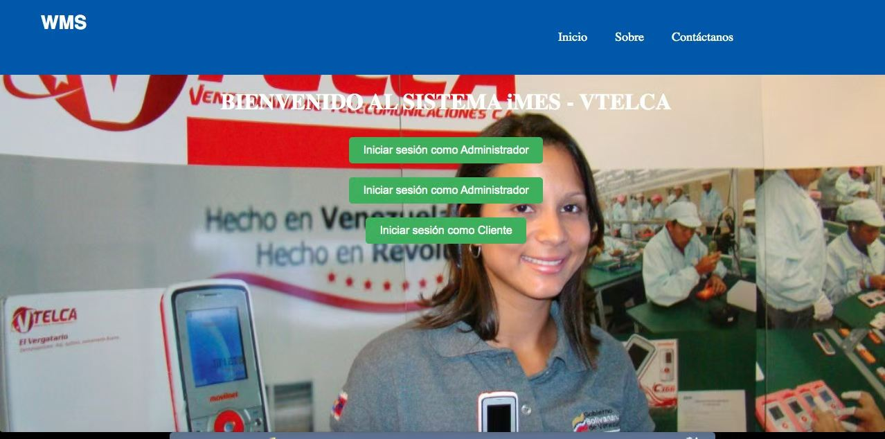
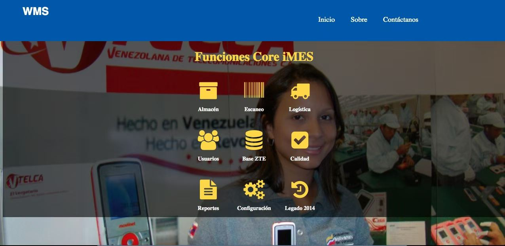
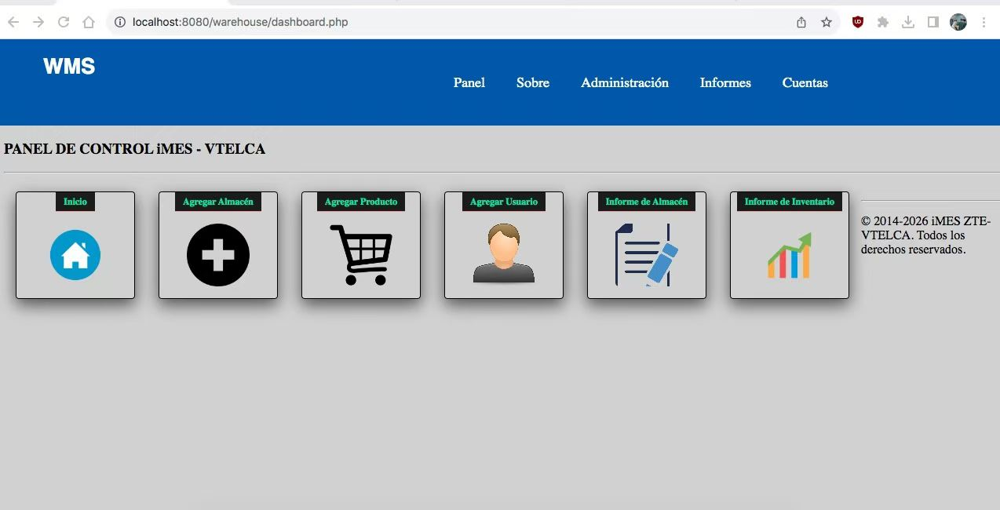

## Screenshots / 界面截图

### Login & Dashboard

### Inventory Management

### WMS Tracking

# IMES-WMS Project for VTELCA (Venezuela)
### Industrial Manufacturing Execution System & Warehouse Management Solution

## 🌐 Project Overview / 项目背景
Implementation of the **IMES-WMS** system at the **VTELCA** plant in Venezuela. This project focused on digitalizing production and warehousing for mobile devices.

本项目是在委内瑞拉 **VTELCA** 工厂实施的 **IMES-WMS** 系统，实现了手机制造流程的数字化管理。

---

## 🚀 Key Highlights / 项目亮点
* **Full Stack Logic:** Includes complete PHP `application` logic and `new.sql` database schema.
* **Bilingual Implementation:** Requirement analysis and support conducted in **English** and **Spanish**.
* **Industrial Scale:** Managed real-time traceability for large-scale manufacturing.

Warehouse Management System (WMS) for the VELCA Project in Venezuela, developed for VTELCA and ZTE. Features an intuitive UI with Panels (Dashboards), advanced reporting, and user administration to optimize supply chain fulfillment operations.

---

## 🇪🇸 Resumen (Spanish)
Sistema de gestión de almacenes del Proyecto VELCA en Venezuela, desarrollado con código fuente y diseño de base de datos para VTELCA y ZTE. El sistema cuenta con paneles (Dashboards), informes avanzados y administración de usuarios, optimizando las operaciones de cumplimiento de la cadena de suministro.

Implementación exitosa del sistema **IMES-WMS** en **VTELCA**, optimizando la trazabilidad y el control de inventarios en tiempo real.
=======
# iMES-WMS Vtelca (Industrial Manufacturing Execution System)

### 🚀 Project Overview
This project is a comprehensive **iMES (Manufacturing Execution System)** and **WMS (Warehouse Management System)** developed for the **Vtelca** mobile phone factory in Venezuela. It streamlines production tracking, inventory management, and logistics flows.

### 🛠 Tech Stack
* **Backend:** PHP (Core)
* **Database:** MySQL / PostgreSQL
* **Frontend:** HTML5, CSS3, JavaScript
* **Architecture:** Monolithic with RESTful API support

### 📂 Database Setup
The core database structure is contained in the `new.sql` file.
1. Create a new MySQL database.
2. Import `new.sql` to set up tables for Users, Products, Categories, and Transactions.

### 📡 API Features
The system includes a RESTful API layer for integration with mobile scanners and external platforms.
* **Endpoint:** `/api/get_products.php`
* **Method:** GET
* **Description:** Returns real-time inventory levels in JSON format.

### 💼 Key Highlights
* **Industrial Scale:** Designed for a real-world mobile phone production line.
* **Multilingual Support:** Implemented with localized logic for Latin American markets.
* **Logistics Efficiency:** Includes modules for warehouse entry/exit and barcode scanning logic.
## Screenshots / 界面截图

### Login & Dashboard

### Inventory Management

### WMS Tracking

# IMES-WMS Project for VTELCA (Venezuela)
### Industrial Manufacturing Execution System & Warehouse Management Solution

## 🌐 Project Overview / 项目背景
Implementation of the **IMES-WMS** system at the **VTELCA** plant in Venezuela. This project focused on digitalizing production and warehousing for mobile devices.

本项目是在委内瑞拉 **VTELCA** 工厂实施的 **IMES-WMS** 系统，实现了手机制造流程的数字化管理。

---

## 🚀 Key Highlights / 项目亮点
* **Full Stack Logic:** Includes complete PHP `application` logic and `new.sql` database schema.
* **Bilingual Implementation:** Requirement analysis and support conducted in **English** and **Spanish**.
* **Industrial Scale:** Managed real-time traceability for large-scale manufacturing.

Warehouse Management System (WMS) for the VELCA Project in Venezuela, developed for VTELCA and ZTE. Features an intuitive UI with Panels (Dashboards), advanced reporting, and user administration to optimize supply chain fulfillment operations.

---

## 🇪🇸 Resumen (Spanish)
Sistema de gestión de almacenes del Proyecto VELCA en Venezuela, desarrollado con código fuente y diseño de base de datos para VTELCA y ZTE. El sistema cuenta con paneles (Dashboards), informes avanzados y administración de usuarios, optimizando las operaciones de cumplimiento de la cadena de suministro.

Implementación exitosa del sistema **IMES-WMS** en **VTELCA**, optimizando la trazabilidad y el control de inventarios en tiempo real.
>>>>>>> 1067fe6 (Fix: local sync before rebase)
